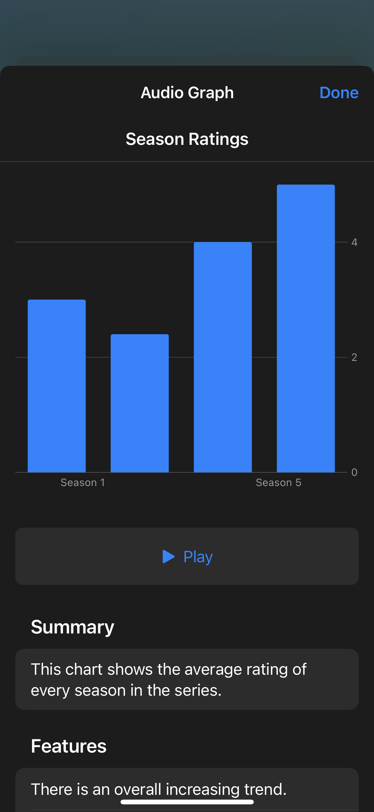
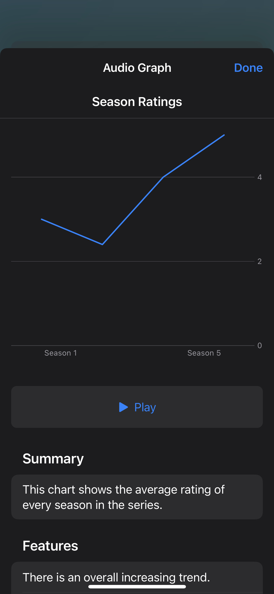

# react-native-ax-chart

React Native wrapper for iOS's accessible chart protocol [`AXChart`](https://developer.apple.com/documentation/accessibility/axchart)

## Installation

```sh
yarn add react-native-ax-chart
pod install
```

## Background

Introduced in iOS 15.0, the `AXChart` protocol allows you to "create an accessible representation of a chart — a view that displays a graphical representation of a data set — for VoiceOver to play as an audio graph."

While this package is compatible with iOS 11.0 and above, **the accessibility functionality is only available on devices running iOS 15.0 and above**.

For more information on how `AXChart` works, check out the introductory WWDC video: <https://developer.apple.com/videos/play/wwdc2021/10122/>

### Examples

The following are examples of what this library will produce for two types of charts: a non-continuous bar chart and a continuous line graph.

| Non-continuous                                                                    | Continuous                                                                                |
| --------------------------------------------------------------------------------- | ----------------------------------------------------------------------------------------- |
|  |  |

## Features

> **Note**
> This library (as it's currently written) is **best suited** for use with left-to-right bar charts and line graphs. Support for other charts will come in future versions.

### Supported

- **Title and summary:** Define an (optional) chart title and summary

- **X-axis:** Define a categorical x-axis

- **Y-axis:** Define a numerical y-axis

- **Series:** Define one or multiple (non-)continuous data series

### Not Supported (yet!)

The following are supported with the `AXChart` protocol, but have not been added to this library (yet!):

- **Additional axes:** You _cannot_ define additional categorical or numerical axes beyond the x-axis and y-axis

- **Numerical x-axis:** You _cannot_ define a numerical x-axis; you must use categorical for now

- **Y-Axis gridline positions:** You _cannot_ define the positions of gridlines along the axis

- **Content direction:** You _cannot_ specify the direction of the content in the chart

Pull requests are welcome! 🤗

## Usage

For more information on all of the props, check out [the official `AXChartDescriptor` documentation](https://developer.apple.com/documentation/accessibility/axchartdescriptor).

```tsx
import { AXChart, AXChartDescriptor } from 'react-native-ax-chart';

// ...

const descriptor: AXChartDescriptor = {
  title: 'Season Ratings',
  summary:
    'This chart shows the average ratings of every season in the series.',
  xAxis: {
    title: 'Seasons',
    categoryOrder: ['Season 1', 'Season 2', 'Season 3'],
  },
  yAxis: {
    title: 'Ratings',
    lowerBound: 0.5,
    upperBound: 5.0,
    valueDescription: {
      singular: 'star',
      plural: 'stars',
    },
  },
  series: [
    {
      name: 'Average Ratings',
      isContinuous: true,
      dataPoints: [
        { x: 'Season 1', y: 2.4 },
        { x: 'Season 2', y: 4.1 },
        { x: 'Season 3', y: 5.0 },
      ],
    },
  ],
};

return (
  <AXChart descriptor={descriptor}>
    <SeasonRatingsChart />
  </AXChart>;
);
```

## Contributing

See the [contributing guide](CONTRIBUTING.md) to learn how to contribute to the repository and the development workflow.

## License

MIT

---

Made with [create-react-native-library](https://github.com/callstack/react-native-builder-bob)
